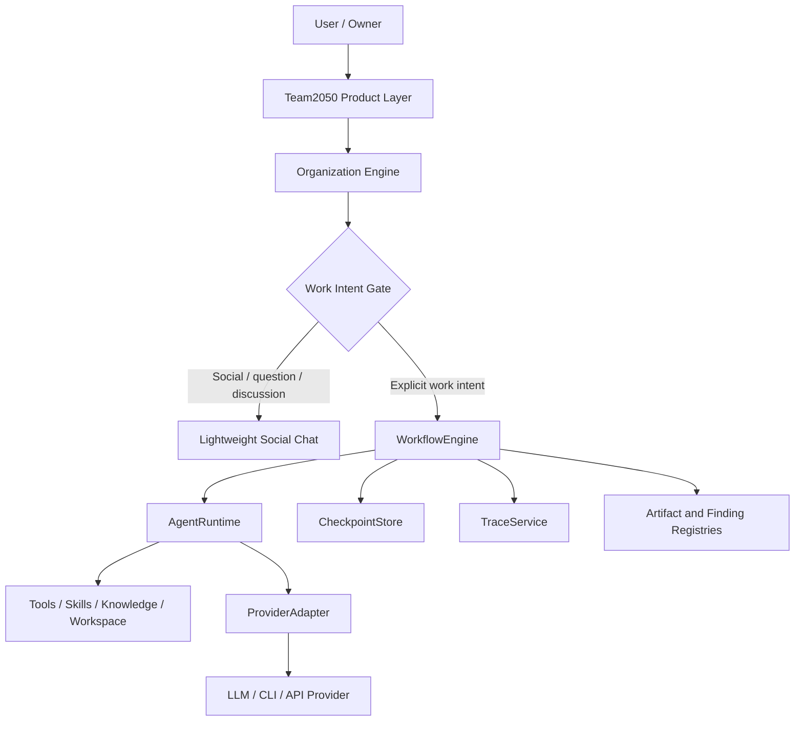

# Runtime V2 Target Architecture

Status: experimental design, not a production migration. Updated: 2026-08-13.

## Product boundary

Team2050 is the system of record for users, organizations, departments,
employees, professions, roles, personalities, skills, knowledge, training,
tasks, artifacts, findings, approvals, conversations and provider assignments.
An orchestration framework is an implementation detail below these concepts.



The critical invariant is:

```text
Employee -> AgentProfile -> AgentRuntime -> ProviderAdapter -> Provider
```

An employee keeps the same identity, skills, work history and task state when
the provider changes. Provider sessions never own authoritative employee memory.

## Runtime boundaries

- `WorkIntentGate` conservatively classifies SOCIAL, QUESTION, DISCUSSION,
  WORK_REQUEST, WORK_CONTINUATION, WORK_MODIFICATION, WORK_STOP and WORK_REVIEW.
- `WorkflowEngine` owns structured state, dependency scheduling, pause/resume,
  cancellation, checkpoints and human decisions.
- `AgentRuntime` receives an employee action, scoped workspace, contextual
  requirements, concrete input artifacts and an action risk class.
- `ProviderAdapter` reports capabilities and executes a provider call. It does
  not persist employee state.
- `CheckpointStore`, `TraceService`, artifact and finding repositories are
  interfaces. JSON is only the prototype backend; PostgreSQL/cloud backends can
  replace it without changing domain logic.

## Social and work separation

A chat message is not a task. Greetings, jokes and ordinary discussion never
create a workflow. Explicit work requests enter director-first coordination.
Direct requests such as "Elena, review this document" may create one assigned
action. Team work starts with the Director, not one identical action per member.
While work runs, status questions remain social reads over runtime state.

## Execution

The prototype executes a dependency graph in waves. Independent ready steps are
submitted concurrently. Downstream steps wait for completed dependencies and
their artifact evidence. Handoffs are typed records containing source, target,
task, artifact IDs, operation and expected output.

Every transition is checkpointed atomically. On restart completed steps remain
completed; an interrupted RUNNING step returns to READY under a crash recovery
policy. Retry is reason-specific. Timeout, provider failure, invalid output and
missing evidence may retry; permission denial and owner approval never spin.

Cancel moves through CANCEL_REQUESTED, CANCELLING and CANCELLED. Communication
budgets cap provider calls, retries, handoffs and review cycles.

## Security and workspace

Workspaces are derived through configuration:

```text
workspace/organizations/<org>/projects/<project>/tasks/<task>/
```

Resolved paths cannot escape the task root. Actions are typed READ, WRITE,
EXECUTE, NETWORK, INSTALL, DELETE, PUBLISH or EXTERNAL_SIDE_EFFECT. INSTALL,
DELETE, PUBLISH and external side effects require owner approval by default.

## Framework adapter direction

Production code should depend on Team2050 contracts, not framework APIs. A later
pilot may implement `LangGraphWorkflowEngine` behind `WorkflowEngine`. Microsoft
Agent Framework remains a candidate for server/cloud runtime after dependency
budget and API maturity improve. OpenHands patterns inform tool/workspace
security but do not justify making Team2050 an OpenHands fork.
