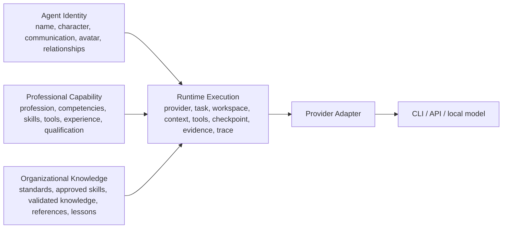
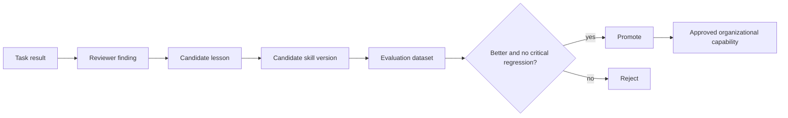

# Universal Agent Runtime V2 Model

Status: benchmark decision input. This is not an approved production migration.

## Four independent levels



Identity is not a provider session. Capability is not a persona. Organizational
knowledge is not an employee's chat history. Runtime state is not stored only
in a prompt.

## Canonical state

`CanonicalAgentState` in `models.py` is the executable schema. Its top-level
fields are:

```text
schema_version
run_id
agent_id, organization_id, role_id
identity
capability
active_task, task_state, task_plan
conversation_summary
working_context[] with provenance and token cost
skills_used[], knowledge_used[], standards_used[]
artifact_ids[], findings[], decisions[]
tool_results[], evidence[]
workspace (logical workspace:// URI and permissions)
pending_actions[]
checkpoint
provider_binding and ordered fallback candidates
completed_effect_keys[]
trace_id
```

The provider receives a bounded `ProviderRequest`, not the database, raw chat
history or another provider's hidden reasoning. A provider switch preserves all
canonical fields and changes only `provider_binding`.

## Routing and team work

The production router should eventually classify:

```text
SOCIAL | DIRECT | INFORMATION | TASK | TEAM_TASK
```

SOCIAL remains chat. DIRECT/TASK selects one capable employee first. TEAM_TASK
creates a coordinator-owned task graph only when decomposition, independent
specialists or review justify it. An organization template chooses policy:
sequential, parallel, handoff, review loop, manager-led or bounded group
discussion. No policy broadcasts every user message to every employee.

## Artifacts and handoffs

An artifact is versioned and addressable:

```text
artifact_id, type, owner, version, logical_uri, content_hash,
provenance, status, history
```

A handoff is data, not prose:

```text
handoff_id, from_agent_id, to_agent_id, task_id, intent,
artifact_ids, expected_output, constraints, context_refs,
acceptance, evidence_requirements, status
```

The handoff experiment refuses missing artifact IDs. The receiver gets the
actual artifact content and provenance; conversation reconstruction is not a
fallback.

## Durable execution and side effects

Every meaningful transition writes a checkpoint. External effects use stable
`effect_key` values:

1. Check for an existing committed effect.
2. Execute provider/tool only when absent.
3. Commit effect result under the key.
4. Apply artifact/evidence to canonical state.
5. Checkpoint the transition.

If the process crashes between 3 and 5, restart reconciles the committed effect
instead of repeating it. This is an inbox/outbox-style prototype contract, not
a claim that arbitrary external systems are transactional. Non-idempotent
external APIs need provider-specific idempotency keys or reconciliation.

Provider timeout and unavailable errors can select a fallback. Permission
denial, forbidden action and approval requirements do not spin. Action classes
are `AUTO`, `NOTIFY`, `APPROVAL_REQUIRED`, `FORBIDDEN`.

## Context Engine V2

`ContextAssemblerV2` selects provenance-bearing references under a token
budget. Candidate kinds are:

- recent conversation summary;
- active task and current step;
- relevant decisions and findings;
- concrete artifacts;
- relevant skills, knowledge and standards;
- structured colleague handoffs.

Selection is deterministic by relevance then stable ID. Absolute paths are not
canonical context; artifact/workspace logical URIs are resolved by the local or
server deployment.

## Skill Package V2

Target portable layout:

```text
skills/<domain>/<skill>/
  SKILL.md
  metadata.json
  sources/
  examples/
  tests/
  evaluations/
  versions/
```

Required metadata: `skill_id`, profession/domain, version, lifecycle status,
source provenance, instructions, examples, tools, limitations, deterministic
tests, evaluation history and contributors.

The system keeps distinct records:

- **Knowledge:** a sourced fact or explanation.
- **Skill:** a procedure for accomplishing work.
- **Standard:** an approved organizational rule.
- **Experience:** what happened in a concrete task.
- **Reference:** the material from which information came.

## Learning and qualification



Evaluation combines deterministic checks, task acceptance, reviewer scores,
user feedback, regression tasks and optional LLM judges. An LLM judge is one
signal, never the authority. Promotion requires improvement against the current
version and zero critical regressions.

Human qualification states should be categorical:

```text
NOT_STUDIED -> LEARNING -> PRACTICING -> VERIFIED -> PROFICIENT
```

Transitions require linked evidence such as a knowledge test, practical task,
review result and repeated successful use. The UI must not show an unexplained
73% or 87%.

Validated knowledge belongs to the organization. Deleting an employee removes
identity according to policy but preserves approved knowledge, standards,
skills and sources. Provenance records the contributor as deleted/anonymized.
A new employee receives the profession baseline plus approved organizational
knowledge and skills. The deletion/bootstrap test executes this invariant.

## Learning Coordinator

The coordinator identifies competency gaps, failures and missing sources; it
may create candidate knowledge/skills and schedule evaluations. It cannot mark
them validated without the organization's review policy. Internet research
must store URL/source, retrieval date, author/publisher, reliability, extracted
claims and usage links.

## Observability and evaluation

The neutral `TraceEvent` schema records trace/run/task/agent/provider/model,
start/end/latency, context reference IDs, skills, knowledge, tools, artifacts,
handoffs, errors, result and usage. SQLite is sufficient for today's desktop.
An exporter may later send the same records to OpenTelemetry or Langfuse.

Evaluation datasets are versioned product records. CI compares current and
candidate skill/runtime behavior, stores item-level results and aggregate
scores, and rejects regressions. Production feedback becomes a linked event,
not an automatic prompt mutation.

## Today and future

Today:

```text
PySide desktop -> application services -> SQLite runtime store
                                      -> CLI provider adapters
                                      -> local controlled workspace
```

Future:

```text
desktop/web clients -> server API -> runtime workers
                                 -> SQL event/checkpoint store
                                 -> provider/tool/MCP adapters
                                 -> local/container/remote workspaces
```

Stable IDs and logical URIs permit this transition. No canonical record depends
on `D:\...` or a provider-private conversation ID.

## Architecture options

| Criterion | A: Microsoft Agent Framework | B: LangGraph adapter | C: Team2050 thin core + optional adapters |
|---|---|---|---|
| Reliability | Strong workflow/checkpoint reference; APIs still evolving | Strong persistence/pending writes | Depends on our tests; prototype proves key invariants |
| Complexity | High for Windows desktop footprint | Medium | Low initially, grows only with product requirements |
| Vendor lock-in | Medium framework coupling | Medium graph/checkpointer coupling | Low; Team2050 owns contracts |
| Provider portability | Good if state stays outside agent | Good if state remains Team2050 schema | Best: explicit provider-neutral state |
| Desktop suitability | Medium | Good | Best today: stdlib SQLite, no new dependency |
| Future server suitability | Strong | Strong | Good; add worker/framework adapter later |
| Migration cost | High | Medium | Low and incremental |
| Debuggability | Good telemetry, more framework layers | Strong graph/state inspection | Strong product-level traces, less runtime machinery |
| Learning-system fit | Must be built above framework | Must be built above framework | Native product model |

### Recommendation

Choose **Option C: a thin Team2050-owned canonical runtime with adapter
boundaries**, borrowing LangGraph's durable-task/idempotency semantics,
Microsoft Agent Framework's orchestration/checkpoint/HITL taxonomy, OpenHands'
workspace/tool security and Langfuse's trace/evaluation model.

Keep an optional `WorkflowEngine` adapter seam. Run a later LangGraph pilot on
one bounded workflow; reassess MAF for a server control plane. Do not migrate
production until canonical schemas, migration tests, side-effect contracts and
one real CLI provider-switch pilot receive architecture approval.

## Migration recommendation

1. Approve schemas and invariants, not framework selection.
2. Add shadow-write canonical run/checkpoint/trace records without changing chat.
3. Pilot one direct single-agent task behind a feature flag.
4. Add artifact/evidence and resume acceptance tests with real CLI adapters.
5. Pilot structured handoff and review for one organization template.
6. Migrate learning only after versioned datasets and review policy exist.
7. Keep the legacy runtime as rollback until parity and packaged GUI acceptance.

This sequence avoids a big-bang rewrite and preserves the working product.
